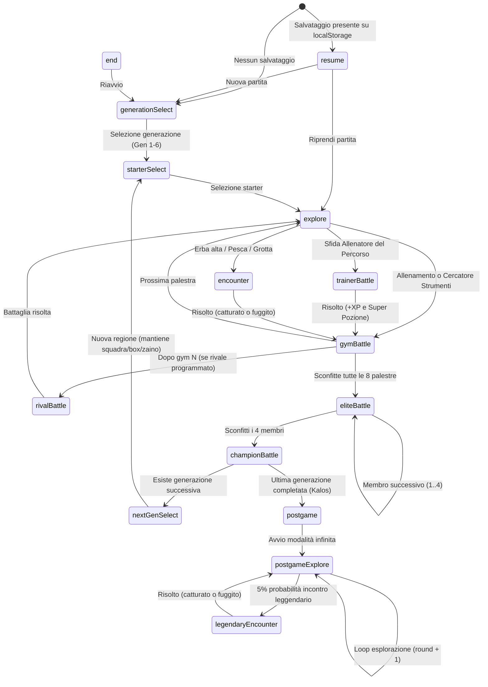

# Manuale Tecnico — Pokémon: Scegli il Cammino (v6.0)

> Documento di riferimento per sviluppatori. Descrive l'architettura, il flusso di gioco, i moduli e le decisioni tecniche della codebase aggiornata alla v6.0 (Sala della Fama & Hall of Fame Storica, Megaevoluzione / Gigamax, Modalità Nuzlocke Hardcore, Efficacia Tipi, Boss Narrative & Master Ball).

---

## 1. Panoramica del Progetto

**Pokémon: Scegli il Cammino** è un'avventura Pokémon interattiva per browser basata su scelte narrative e strategiche. Copre **tutte le 9 generazioni ufficiali Pokémon** (Kanto, Johto, Hoenn, Sinnoh, Unova, Kalos, Alola, Galar e Paldea). A differenza dei giochi ufficiali o di simulatori casuali, l'esito delle catture e delle battaglie viene calcolato in base alla potenza complessiva della squadra, alle decisioni tattiche, all'uso degli strumenti dallo zaino e a tiri di dado pesati su formule matematiche deterministiche.

### Stack Tecnologico

| Tecnologia | Utilizzo |
|---|---|
| **React 18** (via CDN `esm.sh`) | UI e gestione dello stato globale |
| **Vanilla JS (ES Modules)** | Logica pura, dati e motori di gioco — zero build step |
| **Vanilla CSS** | Design system completo (dark mode, modali, Shiny glow, medaglie grafiche, multi-slot cards, Pokédex Grid 1025) |
| **PokeAPI** (`pokeapi.co`) | Fetch in tempo reale di sprite normali e Shiny, nomi e tipi |
| **`localStorage` & JSON API** | Persistenza multi-slot (3 slot), esportazione/importazione backup JSON e Pokédex storico (1025 specie) |

> [!IMPORTANT]
> **Nessun passo di build.** Il progetto non richiede Node/npm/Vite per eseguire la app nel browser. React viene importato direttamente tramite `importmap` dentro `index.html` e i componenti React sono scritti con `React.createElement` (alias `e`) per evitare di dipendere da compilatori JSX/Babel.

---

## 2. Struttura del Progetto

```
pokemon-choice-quest/
├── index.html              # Entry point HTML con import map per React/ReactDOM
├── package.json            # Metadati di base
├── README.md               # Guida per l'utente e avvio rapido
├── ROADMAP.md              # Changelog e roadmap dei prossimi sviluppi
├── MANUAL_TECNICO.md       # Manuale tecnico completo del progetto (questo file)
├── SPEC.md                 # Documento di specifica e backlog
├── scripts/
│   └── simulate-flow.mjs   # Script Node.js per testare a secco le 6 generazioni
└── src/
    ├── main.js             # Punto d'ingresso React: monta <App /> nel DOM
    ├── App.js              # Stato globale, macchina a stati e opzioni di bivio tematiche (13 percorsi)
    ├── styles.css          # Design system CSS unico (variabili, modali, Shiny, visual badges, avatar card, tooltips)
    ├── data/
    │   ├── generations.js  # Dati delle 6 generazioni (Kanto, Johto, Hoenn, Sinnoh, Unova, Kalos)
    │   ├── evolutions.js   # Mappa completa delle evoluzioni (300+ specie)
    │   └── items.js        # Modulo descrizioni e helper per gli strumenti dello zaino
    ├── engine/
    │   ├── battleLogic.js  # Logica pura per cattura, cap Lv100 (clampLevel) e battaglie
    │   └── saveGame.js     # Modulo di salvataggio multi-slot (1..3), export/import JSON e Pokédex
    ├── hooks/
    │   └── usePokemon.js   # Hook React con cache in memoria per PokeAPI (sprite standard + Shiny)
    └── components/
        ├── GenerationSelectScreen.js  # Schermata di selezione della regione iniziale
        ├── StartScreen.js             # Selezione dello starter della generazione
        ├── ChoiceScene.js             # Scena generica a bivio (13 percorsi ed habitat tematici)
        ├── EncounterScene.js          # Scena incontro con Pokémon selvatico / leggendario / Shiny
        ├── BattleScene.js             # Scena battaglia (con card avatar avversario, strumenti e descrizioni)
        ├── EndScreen.js               # Schermata di conclusione della run
        ├── TeamPanel.js               # Sidebar per squadra, box, medaglie visuali (BadgeItem) e zaino (con tooltips)
        ├── PokemonSprite.js           # Componenti PokemonChip e PokemonPreview (supporto Shiny)
        ├── NextGenerationScreen.js    # Transizione alla nuova regione con trasferimento squadra nel PC Box
        ├── PostgameScreen.js          # Schermata intro alla modalità infinita
        ├── PokedexModal.js            # Pokédex Album Grid (721 slot, specie ignote "?", tab Kanto..Kalos, filtri e ricerca)
        ├── ResumeScreen.js            # Schermata di gestione dei 3 Slot e backup JSON
        ├── EvolutionNotice.js         # Overlay animato evoluzioni con opzione Tasto B (annulla)
        └── BoxModal.js                # Modale gestione Box e swap Pokémon
```

---

## 3. Architettura e Macchina a Stati (`src/App.js`)

### 3.1 Diagramma dei Flussi e delle Fasi (`phase`)



### 3.2 Struttura dello Stato Globale (`initialState()`)

```js
{
  // Flusso di gioco
  phase: "generationSelect",
  generationId: null,
  gymIndex: 0,
  eliteIndex: 0,
  rivalDone: false,

  // Squadra e inventario
  team: [],                 // Array<{id, level, isShiny}> (max 6)
  box: [],                  // Array<{id, level, isShiny}> (riserva)
  badges: [],               // Array<string> (medaglie regione corrente)
  items: [],                // Array<string> (oggetti nello zaino)

  // Scena corrente (stato transiente)
  pendingEncounterPool: null,
  pendingEncounterLevel: 4,
  pendingEncounterIsLegendary: false,
  pendingTrainer: null,     // { title, teamIds, power }

  // Multi-generazione e post-game
  multiGenRun: false,
  postgameRound: 0,

  // Pokédex (Nazionale 721 specie)
  pokedexRun: {},           // { [id]: { seen: true, caught: boolean, shiny: boolean } }
  pokedexOpen: false,

  // Evoluzioni e Leggendari
  pendingEvolutions: [],    // Array<{ evolvedFrom, id, level }>
  caughtLegendaries: [],    // Array<number> (ID leggendari catturati)

  // Multi-Slot Save
  activeSlotId: 1,          // 1 | 2 | 3

  // Modali UI
  boxModalOpen: false,
}
```

---

## 4. Moduli di Logica e Persistenza (`src/engine/`)

### 4.1 `battleLogic.js` (Logica Pura di Gioco)

Modulo completamente disaccoppiato da React per il calcolo delle formule matematiche:

- **Cap Massimo Livello**:
  - `MAX_LEVEL = 100` e `clampLevel(level)`: assicura che il livello di ciascun Pokémon non superi mai 100.
- **Cattura**:
  - `computeCaptureChance(method, baseRate)`: applica moltiplicatori (`ball`: 1.0×, `food`: 1.25×) e clamp tra 5% e 95%.
  - `rollCapture(chance, rng = Math.random)`: esegue il tiro di dado.
- **Potenza della Squadra**:
  - `computeTeamPower(team)`: calcola $\sum \min(\text{livelli}, 100) + (\text{lunghezza team} \times 2)$.
- **Vittoria in Battaglia**:
  - `computeWinChance(teamPower, opponentPower, tactic)`: applica i moltiplicatori di tattica (`aggressive`: team 1.2×, `balanced`: 1.0×, `defensive`: team 0.95×, opp 0.8×).
  - Formula: $0.5 + \frac{\text{teamEff} - \text{oppEff}}{2 \times \text{oppEff}}$, clampata tra 12% e 90%.
  - `rollBattle(winChance, rng)`: esegue il tiro di vittoria.

### 4.2 `saveGame.js` (Salvataggio & Pokédex Storico)

Gestisce la persistenza lato client tramite l'API `localStorage`:

- **Salvataggio Multi-Slot (`pcq_save_slot_1`, `2`, `3`)**:
  - `saveGame(state, slotId)`: serializza lo stato filtrando i campi transienti (`SKIP_FIELDS`) salvando il timestamp dell'ultimo aggiornamento.
  - `loadGame(slotId)`: recupera e valida la struttura del salvataggio dello slot specificato.
  - `exportSaveJson(slotId)` / `importSaveJson(jsonString, slotId)`: esportazione/importazione su file locale.
- **Pokédex Storico (`pcq_pokedex_historic`)**:
  - `updateHistoricPokedex(pokemonId, caught, isShiny)`: salva o aggiorna lo stato visto/catturato/shiny con timestamp `firstSeen` e `firstCaught`.
  - `loadHistoricPokedex()`: restituisce la mappa completa delle specie registrate nel browser.

---

## 5. Layer dei Dati (`src/data/`)

### 5.1 `generations.js`

Contiene la configurazione delle **6 generazioni**:

```js
{
  id: "kanto" | "johto" | "hoenn" | "sinnoh" | "unova" | "kalos",
  name: string,
  starterIds: [id1, id2, id3],
  explorationTiers: [
    { level: number, grass: [], fishing: [], cave: [], grass2: [] },
  ],
  items: { cave: [], grass: [] },
  gymLeaders: [ { title, badge, teamIds, opponentPower } ], // 8 elementi
  eliteFour: [ { title, teamIds, opponentPower } ],         // 4 elementi
  champion: { title, badge, teamIds, opponentPower },
  rival: { title, teamIds, opponentPower, afterGymIndex },
  legendaries: [id1, id2, ...]                             // Leggendari post-game
}
```

Funzioni esportate: `getGeneration(id)`, `getExplorationTier(gen, gymIndex)`, `getNextGeneration(currentId)`.

### 5.2 `evolutions.js`

Mappa 300+ specie di Pokémon delle prime 6 generazioni con soglia di livello:

```js
export const EVOLUTIONS = {
  1: { evolvesAt: 16, evolvesTo: 2 }, // Bulbasaur -> Ivysaur
  ...
};
```

---

## 6. Componenti UI (`src/components/`)

| Componente | Ruolo |
|---|---|
| `GenerationSelectScreen` | Selezione della regione di partenza tra Kanto, Johto, Hoenn, Sinnoh, Unova e Kalos. |
| `StartScreen` | Scelta dello starter. Se in run multi-gen, mostra il team attuale che accompagna il giocatore. |
| `ChoiceScene` | Scena narrative a bivio per esplorazione, allenatori di percorso, cercatore strumenti o allenamento. |
| `EncounterScene` | Gestisce l'incontro selvatico/leggendario. Supporta flag `isShiny` e `isLegendary`. |
| `BattleScene` | Scena di combattimento con Card Avatar avversario, uso strumenti dallo zaino e tattiche. |
| `TeamPanel` | Sidebar fissa: squadra (max 6), anteprima box, medaglie grafiche (`BadgeItem`) e zaino. |
| `PokemonSprite` | `PokemonChip` (formato compatto 34px) e `PokemonPreview` (formato card 72px) con supporto Shiny ✨. |
| `NextGenerationScreen` | Transizione alla nuova regione mantenendo il team/box/zaino accumulato. |
| `PostgameScreen` | Schermata celebrativa e di passaggio alla modalità infinita. |
| `PokedexModal` | Modale con 721 specie (Gen 1-6), visualizzazione specie ignote, filtri rapidi e ricerca per ID. |
| `ResumeScreen` | Schermata di gestione dei 3 Slot di salvataggio e backup JSON. |
| `EvolutionNotice` | Overlay animato di evoluzione con opzione per annullare/bloccare l'evoluzione di ciascun Pokémon (Tasto B). |
| `BoxModal` | Modale di gestione della riserva con UX a 2 colonne per scambiare Pokémon tra squadra e box. |

---

## 7. Design System CSS (`src/styles.css`)

### Variabili CSS principali (`:root`)

- `--bg`: `#0f1620` (Sfondo globale scuro con gradiente radiale)
- `--panel`: `#16202c` (Pannelli principali)
- `--panel-alt`: `#1d2b3a` (Card, chip e bottoni secondari)
- `--accent`: `#ffcb05` (Giallo iconico Pokémon)
- `--accent-2`: `#3c5aa6` (Blu iconico Pokémon)
- `--success`: `#4caf7d` / `--danger`: `#e0554f`
- `--radius`: `14px`

### Stili Speciali Aggiunti in v4+ e v5.0
- `.pokedex-modal`: Layout a modale con filtri rapidi, input di ricerca, e carte per specie ignote (`.pokedex-entry.unseen`).
- `.badge-visual-chip`: Chip con gradiente, border accent e icona emoji tematica per ciascuna medaglia.
- `.trainer-avatar-card`: Card avatar in `BattleScene` con icona circolare dell'allenatore e potenza calcolata.
- `.shiny-badge`: Badge dorato Shiny ✨ con animazione CSS shimmer e bordo dorato.
- `.slot-card`: Scheda slot salvataggio con anteprima squadra e azioni per export/import JSON.

---

## 8. Script di Simulazione (`scripts/simulate-flow.mjs`)

Script eseguibile via Node.js per la verifica automatica del flusso di gioco:

```bash
node scripts/simulate-flow.mjs
```

Esegue una simulazione a secco di tutte e 6 le generazioni verificate in sequenza (22 passi ciascuna), assicurandosi che nessun indice di palestra, rivale, Alto Comando o campione risulti `undefined` o generi eccezioni di runtime.

