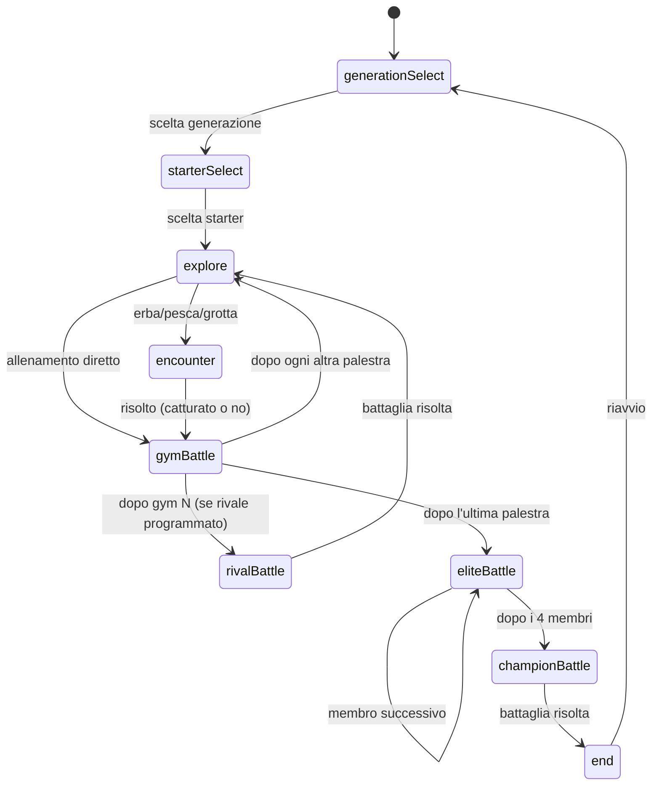

# Manuale Tecnico — Pokémon: Scegli il Cammino (v2)

> Documento di riferimento per sviluppatori. Descrive l'architettura, il flusso di gioco, i moduli e le decisioni tecniche dell'attuale codebase.

---

## 1. Panoramica del Progetto

**Pokémon: Scegli il Cammino** è una piccola avventura Pokémon interattiva ispirata a [Pokemon Roulette](https://zeroxm.github.io/pokemon-roulette/), con una differenza chiave: **non c'è casualità pura**. Il giocatore prende decisioni narrative ad ogni passo (quale zona esplorare, come catturare, quale tattica usare in battaglia), e l'esito è calcolato da una logica deterministica + un tiro di dado pesato sulla scelta fatta.

### Stack Tecnologico

| Tecnologia | Utilizzo |
|---|---|
| **React 18** (via CDN `esm.sh`) | UI e gestione stato |
| **Vanilla JS (ES Modules)** | Logica e dati — nessun JSX, nessun Babel |
| **Vanilla CSS** | Stile — dark mode, glassmorphism leggero |
| **PokeAPI** (`pokeapi.co`) | Sprite, nomi, tipi dei Pokémon (fetch real-time) |
| **`npx serve` / `python3 -m http.server`** | Server statico di sviluppo |

> [!IMPORTANT]
> **Nessun build step.** Il progetto non usa Vite, Webpack, CRA o Babel. React viene importato direttamente via `import map` in `index.html`. I componenti usano `React.createElement` (alias `e`) al posto di JSX.

---

## 2. Struttura del Progetto

```
pokemon-choice-quest/
├── index.html              # Entry point: import map per React/ReactDOM via CDN
├── package.json            # Solo metadati (name, version) — nessuna dipendenza npm
├── README.md               # Guida utente e avvio
├── SPEC.md                 # Backlog e decisioni di design per le prossime feature
├── scripts/
│   └── simulate-flow.mjs   # Script Node.js per validare la sequenza di gioco
└── src/
    ├── main.js             # Monta React nel DOM (#root)
    ├── App.js              # Stato globale + macchina a stati delle fasi
    ├── styles.css          # Design system CSS (variabili + classi)
    ├── data/
    │   ├── generations.js  # Dati delle generazioni (starter, palestre, lega, ecc.)
    │   └── pools.js        # ⚠️ DEPRECATO — superato da generations.js
    ├── engine/
    │   └── battleLogic.js  # Logica pura (matematica di cattura e battaglia)
    ├── hooks/
    │   └── usePokemon.js   # React hook: fetch + cache dati da PokeAPI
    └── components/
        ├── GenerationSelectScreen.js
        ├── StartScreen.js
        ├── ChoiceScene.js
        ├── EncounterScene.js
        ├── BattleScene.js
        ├── EndScreen.js
        ├── TeamPanel.js
        └── PokemonSprite.js
```

---

## 3. Architettura e Flusso di Stato

### 3.1 Macchina a Stati (`App.js`)

Tutta la logica di progressione è centralizzata in `App.js` tramite un singolo oggetto `state` gestito con `useState`. Non c'è router né state manager esterno.

**Fasi (`phase`) possibili:**



**Struttura dello `state`:**

| Campo | Tipo | Descrizione |
|---|---|---|
| `phase` | `string` | Fase corrente del gioco |
| `generationId` | `string \| null` | `"kanto"` o `"johto"` |
| `gymIndex` | `number` | Indice (0-based) della prossima palestra |
| `eliteIndex` | `number` | Indice del membro corrente dell'Alto Comando |
| `rivalDone` | `boolean` | Se la battaglia col Rivale è già avvenuta |
| `team` | `Array<{id, level}>` | Squadra attiva del giocatore |
| `badges` | `Array<string>` | Medaglie vinte |
| `items` | `Array<string>` | Oggetti nello zaino |
| `pendingEncounterPool` | `Array<number> \| null` | Pool di ID per l'incontro in corso |
| `pendingEncounterLevel` | `number` | Livello del Pokémon selvatico |

### 3.2 Funzioni di Mutazione dello Stato

Tutte le mutazioni sono funzioni pure in `App.js`:

| Funzione | Comportamento |
|---|---|
| `update(patch)` | Merge parziale dello stato |
| `addToTeam(pokemon)` | Aggiunge `{id, level}` al team |
| `addBadge(badge)` | Aggiunge una medaglia (ignora se `null`) |
| `addItem(item)` | Aggiunge un oggetto allo zaino |
| `boostTeam(amount)` | Aumenta il livello di tutti i Pokémon del team |
| `goTo(phase, patch)` | Cambia fase + merge opzionale |
| `resolveBattleWin(badge)` | Assegna medaglia + boost team (+3 livelli) |
| `advanceAfterGymBattle()` | Decide la prossima fase dopo una palestra |

---

## 4. Layer dei Dati (`src/data/`)

### 4.1 `generations.js`

Fonte unica di verità per tutti i dati di gioco. Esporta un array `GENERATIONS` dove ogni elemento descrive una generazione giocabile:

```js
{
  id: "kanto",
  name: "Kanto",
  starterIds: [1, 4, 7],          // ID PokeAPI degli starter

  explorationTiers: [             // 3 livelli di difficoltà crescente
    { level, grass, fishing, cave, grass2 }  // pool di ID per ogni zona
  ],

  items: {
    cave: [...],                  // oggetti trovabili in grotta
    grass: [...]                  // oggetti trovabili nell'erba
  },

  gymLeaders: [                   // 8 elementi
    { title, badge, teamIds, opponentPower }
  ],

  eliteFour: [                    // 4 elementi
    { title, teamIds, opponentPower }
  ],

  champion: {
    title, badge, teamIds, opponentPower
  },

  rival: {
    title, teamIds, opponentPower,
    afterGymIndex: 2              // appare dopo la 3a palestra (0-based)
  }
}
```

**Funzioni esportate:**

| Funzione | Firma | Descrizione |
|---|---|---|
| `getGeneration(id)` | `(string) → Generation \| null` | Trova una generazione per ID |
| `getExplorationTier(gen, gymIndex)` | `(Generation, number) → Tier` | Calcola il tier corretto (`floor(gymIndex/3)`) |
| `getNextGeneration(currentId)` | `(string) → Generation \| null` | Restituisce la generazione successiva nell'array |

### 4.2 `pools.js` (deprecato)

File originale della v1, non più usato. Può essere eliminato in sicurezza.

---

## 5. Engine di Gioco (`src/engine/battleLogic.js`)

Modulo **puro**: nessuna dipendenza da React, nessun side-effect. Facile da testare in isolamento.

### 5.1 Cattura

```
computeCaptureChance(method, baseRate) → number (0..1)
```
- `ball`: moltiplicatore `1.0`
- `food`: moltiplicatore `1.25` (più efficace)
- Risultato clampato tra `0.05` e `0.95`

```
rollCapture(chance, rng?) → boolean
```

### 5.2 Potenza del Team

```
computeTeamPower(team) → number
```
- Somma dei livelli + `teamLength × 2` (bonus per numero di Pokémon)

### 5.3 Battaglia

```
computeWinChance(teamPower, opponentPower, tactic) → number (0..1)
```

**Tattiche e modificatori:**

| Tattica | Moltiplicatore Team | Moltiplicatore Avversario |
|---|---|---|
| `aggressive` | 1.2× | 1.0× |
| `balanced` | 1.0× | 1.0× |
| `defensive` | 0.95× | 0.8× |

Formula: `0.5 + (teamEff - oppEff) / (2 × oppEff)`, clampata tra `0.12` e `0.90`.

```
rollBattle(winChance, rng?) → boolean
```

---

## 6. Hook React (`src/hooks/usePokemon.js`)

```js
usePokemon(id) → { data, loading, error }
```

- Esegue `fetch` a `https://pokeapi.co/api/v2/pokemon/{id}`
- Mantiene una **cache in-memory** (`Map`) condivisa tra tutti i componenti: la stessa chiamata non viene mai ripetuta nella stessa sessione
- Il `data` restituito contiene: `id`, `name`, `types[]`, `sprite` (official artwork o fallback), `spriteShiny`

---

## 7. Componenti UI (`src/components/`)

### 7.1 `GenerationSelectScreen`
Schermata iniziale. Mostra le generazioni disponibili (Kanto, Johto). Callback: `onChooseGeneration(id)`.

### 7.2 `StartScreen`
Selezione dello starter. Riceve `starterIds[]` e mostra ogni Pokémon con sprite via `usePokemon`. Callback: `onChooseStarter(id)`.

### 7.3 `ChoiceScene`
Schermata bivio generica. Riceve un array di `choices[]` ognuno con `id`, `label`, `hint`, `onSelect`. Renderizza una lista di `choice-btn`.

### 7.4 `EncounterScene`
Scena incontro selvatico:
1. Estrae un Pokémon casuale dal `pool` (una volta, con `useMemo`)
2. Mostra sprite con `PokemonPreview`
3. Offre 3 scelte: Poké Ball, cibo, ignora
4. Chiama `computeCaptureChance` + `rollCapture` → mostra risultato
5. Callback: `onResolved({ caught, pokemon })`

### 7.5 `BattleScene`
Scena battaglia:
1. Calcola `teamPower` con `computeTeamPower`
2. Mostra sprite avversari con `PokemonChip`
3. Offre 3 tattiche: aggressiva, bilanciata, difensiva
4. Chiama `computeWinChance` + `rollBattle` → mostra risultato
5. Se si perde: opzioni "Riprova" o "Ritirati e prosegui"
6. Callback: `onResolved({ won })`

### 7.6 `TeamPanel`
Pannello laterale sempre visibile. Mostra squadra (con `PokemonChip` per ogni membro), medaglie, e oggetti zaino.

### 7.7 `PokemonSprite` / `PokemonChip` / `PokemonPreview`
Componenti di rendering dello sprite:
- `PokemonChip`: formato compatto (34px, pill-shaped) per squadra/avversari
- `PokemonPreview`: formato grande (72px, card) per incontri selvatici

### 7.8 `EndScreen`
Schermata di fine. Mostra squadra, medaglie e pulsante "Gioca di nuovo" (che chiama `onRestart`, che resetta lo stato a `initialState()`).

---

## 8. Design System (`src/styles.css`)

### Variabili CSS (`:root`)

| Variabile | Valore | Uso |
|---|---|---|
| `--bg` | `#0f1620` | Sfondo pagina |
| `--panel` | `#16202c` | Sfondo pannelli |
| `--panel-alt` | `#1d2b3a` | Sfondo elementi secondari |
| `--accent` | `#ffcb05` | Giallo Pokémon — titoli, bottoni |
| `--accent-2` | `#3c5aa6` | Blu — type pill |
| `--text` | `#eef3f8` | Testo principale |
| `--text-dim` | `#9fb0c0` | Testo secondario/hint |
| `--danger` | `#e0554f` | Rosso — sconfitte |
| `--success` | `#4caf7d` | Verde — vittorie/catture |
| `--radius` | `14px` | Border radius standard |

### Layout
- Griglia a **2 colonne** su schermi ≥ 800px (`2fr 1fr`): contenuto principale + pannello team
- Su mobile: colonna singola

---

## 9. Barra di Avanzamento

Calcolata in `App.js` in base a:
- `totalMilestones = gymLeaders.length + eliteFour.length + 1` (campione)
- `completedMilestones` si aggiorna ad ogni palestra/elite superata
- Renderizzata come barra CSS con `width: X%` e transizione smooth

---

## 10. Script di Test (`scripts/simulate-flow.mjs`)

Script Node.js eseguibile senza browser. Verifica che:
- Tutte le palestre abbiano un indice valido
- La sequenza di gioco (explore → gym → ... → elite → champion) non abbia gap o indici fuori range

Esegui con:
```bash
node scripts/simulate-flow.mjs
```

---

## 11. Decisioni Architetturali Notevoli

| Decisione | Motivazione |
|---|---|
| `React.createElement` invece di JSX | Nessun compilatore Babel: il progetto è zero-build |
| Cache `Map` in `usePokemon` | Evita fetch duplicati tra componenti nella stessa sessione |
| Logica pura in `battleLogic.js` separata da React | Testabile in isolamento, senza DOM |
| `opponentPower` come numero scalare | Semplifica il bilanciamento senza simulare statistiche reali |
| `getExplorationTier` con `floor(gymIndex/3)` | 3 tier riusati per 8 palestre: scalabile, nessuna duplicazione |
| Dati generazioni in array ordinato | `getNextGeneration` può trovare la prossima generazione automaticamente |

---

## 12. Generazioni Implementate

| Gen | ID | Starter | Palestre | Lega |
|---|---|---|---|---|
| Gen 1 | `kanto` | Bulbasaur (#1), Charmander (#4), Squirtle (#7) | 8 (Roccia → Terra) | Ghiaccio, Lotta, Spettro, Drago + Campione |
| Gen 2 | `johto` | Chikorita (#152), Cyndaquil (#155), Totodile (#158) | 8 (Volante → Drago) | Psico, Veleno, Lotta, Buio + Campione |

---

## 13. Dipendenze Esterne

| Dipendenza | Dove | Note |
|---|---|---|
| `react` + `react-dom` | CDN `esm.sh` in `index.html` | Versione 18, caricata via import map |
| `PokeAPI` | `usePokemon.js` (runtime) | Richiede connessione internet; rate limit generoso ma non illimitato |

---

> [!NOTE]
> Nessun salvataggio persistente è implementato nella v2 attuale. Tutto lo stato è in memoria React e si azzera al refresh della pagina. Il Pokédex con `localStorage` è previsto come feature futura (vedi `SPEC.md` §4).
